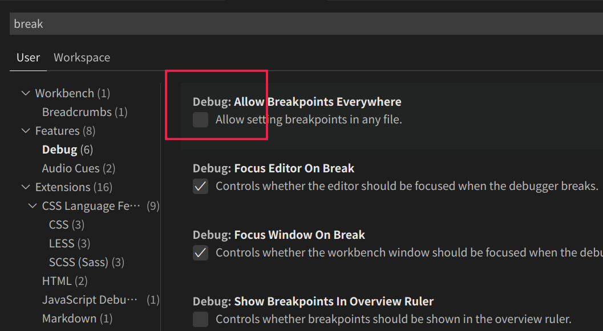
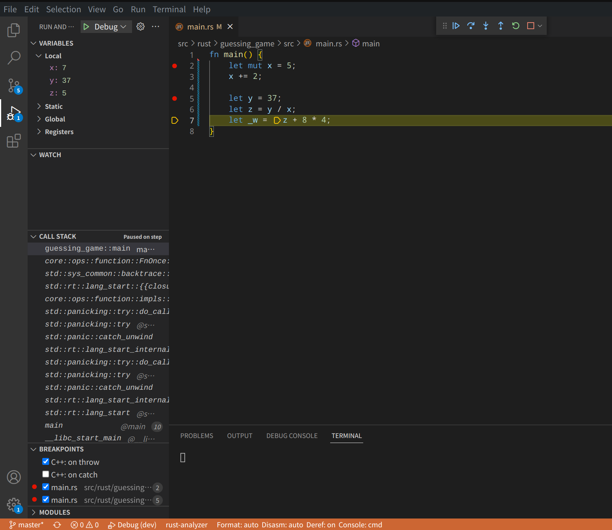

[返回](/docs/dev/base/index.md)


## Rust 开发环境设置

### 0.1 安装 rust编译器及工具链

按如下脚本开始安装

```sh
## 配置国内镜像，提升下载速度
echo "export RUSTUP_DIST_SERVER=https://mirrors.ustc.edu.cn/rust-static" >> ~/.zshrc 
echo "export RUSTUP_UPDATE_ROOT=https://mirrors.ustc.edu.cn/rust-static/rustup" >>  ~/.zshrc
## 配置生效
source ~/.zshrc 

## 获取并执行安装脚本
## 似乎通过下面获取并执行有点慢，使用下面获取脚本，并执行来完成
# curl --proto '=https'  --tlsv1.2 -sSf https://sh.rustup.rs | sh

curl --proto '=https'  --tlsv1.2 -sSf https://sh.rustup.rs >> rustup.sh
sh rustup.sh
```

选择1 执行默认安装

```sh
Current installation options:


   default host triple: x86_64-unknown-linux-gnu
     default toolchain: stable (default)
               profile: default
  modify PATH variable: yes

1) Proceed with installation (default)
2) Customize installation
3) Cancel installation
>1
```

直到 `Rust is installed now. Great! `表示安装成功！

```sh
## 将下面命令添加到 shell 启动文件中，使 Rust 相关命令执行文件生效
source $HOME/.cargo/env

```

```sh
## 查看版本
➜  ~ rustc --version
rustc 1.64.0 (a55dd71d5 2022-09-19)

## 更新到最新版本
➜  ~ rustup update  
info: syncing channel updates for 'stable-x86_64-unknown-linux-gnu'
info: checking for self-updates

  stable-x86_64-unknown-linux-gnu unchanged - rustc 1.64.0 (a55dd71d5 2022-09-19)

info: cleaning up downloads & tmp directories

## 卸载 Rust
➜  ~ rustup self uninstall
```

更多 `rustup` 相关的使用可查其帮助文档。

### 0.2 Cargo

Cargo是Rust 内置的包管理和构建系统 ，在安装Rust时已经安装好，查看 cargo 版本

```sh
➜  ~ cargo --version
cargo 1.64.0 (387270bc7 2022-09-16)
➜  ~ cargo -V       
cargo 1.64.0 (387270bc7 2022-09-16)
```

#### Cargo 的使用

*   创建新项目：*cargo new*
*   编译：*cargo build*
*   运行：*cargo run*
*   更新项目依赖：*cargo update*
*   执行测试：*cargo test*
*   生成文档：*cargo doc*
*   静态检查：*cargo check*
*   cargo clippy: 类似eslint，lint工具检查代码可以优化的地方
*   cargo fmt: 类似go fmt，代码格式化
*   cargo tree: 查看第三方库的版本和依赖关系
*   cargo bench: 运行benchmark(基准测试,性能测试)
*   cargo udeps(第三方): 检查项目中未使用的依赖

另外 cargo build/run --release 使用 release 编译会比默认的 debug 编译性能提升 10 倍以上，但是 release 缺点是编译速度较慢，而且不会显示 panic backtrace 的具体行号。

更多Cargo相关的详情可去 [The Cargo Book](https://doc.rust-lang.org/cargo/)

#### 构建可执行(Executable)项目

```sh
➜  rust git:(master) ✗ cargo new hello --bin
     Created binary (application) `hello` package
➜  rust git:(master) ✗ cd hello && tree
.
├── Cargo.toml
└── src
    └── main.rs

1 directory, 2 files
➜  hello git:(master) ✗ cargo run
   Compiling hello v0.1.0 (/home/jfu/gitee/dev/code/rust/hello)
    Finished dev [unoptimized + debuginfo] target(s) in 1.32s
     Running `target/debug/hello`
Hello, world!
```

#### 构建 Library 项目

```shell
$ cargo new lib-demo --lib
```

在后续的实战练习中详解。

### 0.3 vscode 配置 Rust 开发

主要是根据关键字  rls 和 Native Debug 安装这两个插件

其它推荐插件：

*   rust-analyzer：它会实时编译和分析你的 Rust 代码，提示代码中的错误，并对类型进行标注。你也可以使用官方的 rust 插件取代。
*   rust syntax：为代码提供语法高亮。
*   crates：帮助你分析当前项目的依赖是否是最新的版本。
*   better toml：Rust 使用 toml 做项目的配置管理。better toml 可以帮你语法高亮，并展示 toml 文件中的错误。
*   rust test lens：可以帮你快速运行某个 Rust 测试。
*   Tabnine：基于 AI 的自动补全，可以帮助你更快地撰写代码。

#### 使用 VScode 上使用`LLDB`调试 Rust 程序

> LLDB 是一款高性能调试器，更多详情去 [LLDB](https://lldb.llvm.org/) 了解。

```shell
C/C++ (Windows)
CodeLLDB (OS X / Linux)
```

根据开发平台安装上述调试插件后，Run >  Start Debugging 开启调试后，自动生成 `launch.json`文件，linux 平台如下：

```json
{
    // Use IntelliSense to learn about possible attributes.
    // Hover to view descriptions of existing attributes.
    // For more information, visit: https://go.microsoft.com/fwlink/?linkid=830387
    "version": "0.2.0",
    "configurations": [
        {
            "type": "lldb",
            "request": "launch",
            "name": "Debug",
            "program": "${workspaceFolder}/<executable file>",
            "args": [],
            "cwd": "${workspaceFolder}"
        }
    ]
}
```

在上述配置中的 `program` 字段中**配置好编译出的可执行文件路径**即可。

然后在 `File > Preferences > Settings `, 输入 break , 确保勾选 `Debug: Allow Breakpoints EveryWhere`，即可在源码中打断点。



开启调试了。

通过如下代码演示：

```rust
fn main() {
    let mut x = 5;
    x += 2;

    let mut y = 37;
    let z = y / x;
    let w = z + 8 * 4;
}
```

调试界面如下：
